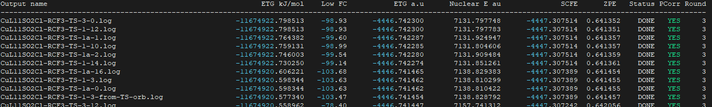

### **Gaussian Extractor**

* **Gaussian Extractor** is a program used to extract energies of gaussian outputs. All gaussian outputs (log files) should be located in a directory. The program will extract Gibbs free energies with correction of solution concentration from gas phase to 1M.

* Gibb free energies are sorted

### How to Run the Program

#### Prerequisites

1. **Compiled Executable**: 
 * g++ (GCC) 14.2.0 is needed for compilation. Other compilers may be good.
 * compile the program with:

```
g++ -o gaussian_extractor.x gaussian_extractor.cpp main.cpp -std=c++17
```

This creates an executable named gaussian_extractor.x in your current directory.

**Input Files**: The program looks for .log files in the current directory (where you run the executable). These are Gaussian output files containing computational chemistry data (e.g., SCF energies, frequencies, etc.).

**Permissions**: Ensure you have execute permissions for the file. You can check and set this with:

```
ls -l gaussian_extractor.x
chmod +x gaussian_extractor.x  # If needed
```

#### Basic Execution

To run the program with default settings:

Navigate to the directory containing your .log files and copy gaussian_extractor.x executable to your bin; remember to export your path in your .bashrc:

```
export PATH=$PATH:~/bin/gaussian-extractor
```

Execute the program:

```
gaussian_extractor.x
```

This runs the program with default parameters:

* Temperature (temp) = temperature value in each output. If there is no temperature there, the default value is 298.15 K

* Concentration (C) = 1 M

* Sort column (column) = 2 (sorts by Gibbs free energy in kJ/mol)

**Quiet Mode**: 

The program will not print output to your terminal, only an output file generated. This is useful when you have huge numbers of outputs (hundred thousands or millions)

```
gaussian_extractor.x -q
```

#### Output

- The program will:
  - Scan the current directory for all .log files.
  
  - Extract data (e.g., energies, frequencies) from each file.
  
  - Sort the results based on the specified column (default is etgkj).
  
  - Write the results to a file named base_directory_name.results in the current directory
  
  - A csv output file can be generated if the program runs with option -f csv:
  
    ```
    Text (default): gaussian_extractor.x
    CSV: gaussian_extractor.x -f csv
    Quiet CSV: gaussian_extractor.x -f csv -q
    ```
  
    
  
- You’ll see console output like:

> Results written to base_directory.results
> Total execution time: X.XXXX seconds

The program will also print output on your terminal by default



***Output explanation:***

* 1st column (*Output name*): the name of gaussian output files
* 2nd column (*ETG Kj/mol*): the Gibbs free energy with all correction (entropy at corresponding temperature and phase correction from gas phase 1 atm to 1 M)
* 3rd column (*Low FC*): the lowest vibrational frequency. This value is useful when you want to see if a gaussian output has imaginary modes or not (geometrical optimization and transition sate search). *Note that the program just prints out the lowest frequency mode. If your outputs have more than two imaginary modes, the program won't let you know. You have to check this yourself for example TS search.* I will implement this  function soon. 
* 4th column (*ETG a.u*): the same as the 2nd one but the unit is hartree or atomic units.
* 5th column (*Nuclear E  au*): Repulsive nuclear energy. This is useful because nuclear energy is very sensitive to coordinates of molecular systems. Two different coordinate systems will have different nuclear energy.
* 6th column (*SCFE*): SCF energy in hartree
* 7th column (*ZPE*): Zero-point energy
* 8th column (*Status*): current status of a gaussian output: DONE or UNDONE (not finished)
* 9th column (*PCorr*): Whether phase correction (gas phase 1atm to 1M in solution) is corrected or not. This value will be YES if your were calcualtions done in solvent (scrf=solvent), and NO if your calculations were done in gas phase. 
* 10th column (*Round*): numbers of gaussian rounds in a gaussian outputs. If your inputs have 1 --link1--, this value will be 2 indicating 2 sections of run in your outputs.

#### Customizing the Run with Command-Line Arguments

The program accepts optional arguments to customize its behavior:

- -t or --temp: Set the temperature in Kelvin. If users specify temperature via -t or --temp, this temperature value will be used for all outputs in the same directory to ensure consistency in calculations of phase correction. ***Note that corresponding temperature should be set in all gaussian inputs to take correction of entropy into account.*** ***The program does not update entropy and thermal correction; therefor if temperature is not set in all gaussian inputs, Gibbs free energy will be wrongly corrected.*** 
- -c or --cm: Set the concentration  (in units of 1000 mM).
- -col or --column: Set the column to sort by (2 to 7, corresponding to etgkj, lf, GibbsFreeHartree, nucleare, scf, zpe).
- -q or --quiet: Run in quiet mode (no console output).
- -f or --format: Output format (text or csv).

Examples:

1. Run with a temperature of 300 K:

```
gaussian_extractor.x -t 300
```

2. Run with a concentration of 2 M and sort by SCF energy (column 6):

```
gaussian_extractor.x -c 2 -col 6
```

3. Combine multiple arguments:

```
gaussian_extractor.x -t 310.15 -c 5 -col 4 -q -f csv 
```


All further functions can be requested via issues

   
