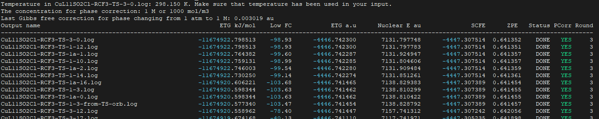

### **Gaussian Extractor**

* **Gaussian Extractor** is a program used to extract energies of gaussian outputs. All gaussian outputs (log files) should be located in a directory. The program will extract Gibbs free energies with correction of solution concentration from gas phase to 1M.

* Gibb free energies are sorted

### How to Run the Program

#### Prerequisites

1. **Compiled Executable**: 
 * g++ (GCC) 14.2.0 is needed for compilation. Other compilers may be good.
 * compile the program with:

```
g++ -o gaussian_extractor.x gaussian_extractor.cpp main.cpp -std=c++17
```

This creates an executable named gaussian_extractor.x in your current directory.

**Input Files**: The program looks for .log files in the current directory (where you run the executable). These are likely Gaussian output files containing computational chemistry data (e.g., SCF energies, frequencies, etc.).

**Permissions**: Ensure you have execute permissions for the file. You can check and set this with:

```
ls -l gaussian_extractor.x
chmod +x gaussian_extractor.x  # If needed
```

#### Basic Execution

To run the program with default settings:

Navigate to the directory containing your .log files and copy gaussian_extractor.x executable to your bin, remember to export your path:

Execute the program:

```
gaussian_extractor.x
```

This runs the program with default parameters:

- Temperature (temp) = 298.15 K
- Concentration multiplier (C) = 1 M
- Sort column (column) = 2 (sorts by etgkj, the Gibbs free energy in kJ/mol)

#### Output

- The program will:
  - Scan the current directory for all .log files.
  - Extract data (e.g., energies, frequencies) from each file.
  - Sort the results based on the specified column (default is etgkj).
  - Write the results to a file named output.results in the current directory.
- You’ll see console output like:

> Results written to base_directory.results
> Total execution time: X.XXXX seconds

The program will also print output on your terminal



#### Customizing the Run with Command-Line Arguments

The program accepts optional arguments to customize its behavior:

- -t or --temp: Set the temperature in Kelvin.
- -c or --cm: Set the concentration  (in units of 1000 mM).
- -col or --column: Set the column to sort by (2 to 7, corresponding to etgkj, lf, GibbsFreeHartree, nucleare, scf, zpe).

Examples:

1. Run with a temperature of 300 K:

```
gaussian_extractor.x -t 300
```

2. Run with a concentration multiplier of 2000 and sort by SCF energy (column 6):

```
gaussian_extractor.x -c 2 -col 6
```

3. Combine multiple arguments:

```
gaussian_extractor.x -t 310.15 -c 5 -col 4
```


   
