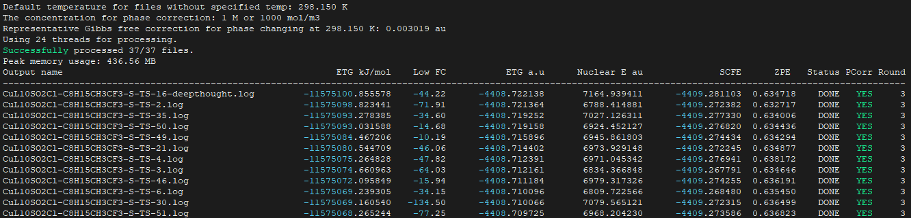

.. Gaussian Extractor documentation master file, created by
   sphinx-quickstart on Thu Sep 05 12:00:00 2025.
   You can adapt this file completely to your liking, but it should at least
   contain the root `toctree` directive.

Gaussian Extractor User Manual
==============================

**Gaussian Extractor** is a high-performance, cluster-safe program designed to extract energies from Gaussian computational chemistry outputs. It processes multiple log files in parallel with comprehensive safety features to prevent system overload and ensure stable operation in shared computing environments.

Overview
--------

Gaussian Extractor provides a comprehensive suite of tools for computational chemistry workflows:

* **Parallel Processing**: Efficiently processes multiple Gaussian output files simultaneously
* **Job Management**: Check and organize completed, failed, and problematic calculations
* **Energy Calculations**: Extract thermodynamic data and calculate high-level energies
* **Coordinate Processing**: Extract and organize molecular coordinates
* **Input Generation**: Create Gaussian input files from XYZ coordinate files
* **Template System**: Generate and reuse parameter templates for different calculation types

Key Features
------------

🔬 **Scientific Capabilities**
   - Extract thermodynamic properties (Gibbs free energy, enthalpy, entropy)
   - Calculate high-level energies combining different theory levels
   - Process coordinates and generate input files
   - Support for various DFT functionals and basis sets

⚡ **Performance & Safety**
   - Multi-threaded processing with automatic resource detection
   - Cluster-aware operation (SLURM, PBS, SGE, LSF)
   - Memory management with automatic limits
   - Graceful shutdown handling

🛠️ **Workflow Integration**
   - Command-line interface with extensive options
   - Configuration file support for defaults
   - Template system for reproducible calculations
   - Interactive mode for Windows users

Getting Started
---------------

New to Gaussian Extractor? Start here:

1. :doc:`installation` - Install the software on your system
2. :doc:`usage` - Learn how to use all features with examples
3. :doc:`api` - Technical API documentation

Quick Start
-----------

.. code-block:: bash

   # Basic usage - extract data from all .log files
   gaussian_extractor.x

   # Check job status and organize files
   gaussian_extractor.x done     # Move completed jobs
   gaussian_extractor.x errors   # Move failed jobs

   # Generate input files from XYZ coordinates
   gaussian_extractor.x ci --calc-type opt_freq

Contents
--------

.. toctree::
   :maxdepth: 2
   :caption: User Guide:

   installation
   usage
   api

.. toctree::
   :maxdepth: 2
   :caption: Developer Guide:

   developer

Indices and Tables
==================

* :ref:`genindex`
* :ref:`modindex`
* :ref:`search`

Support & Contributing
======================

For bug reports, feature requests, or safety concerns:

- - **Issues**: `GitHub Issues <https://github.com/lenhanpham/gaussian-extractor/issues>`_
- **Documentation**: This user manual
- **Help**: Use ``gaussian_extractor.x --help`` for command-line help

License
=======

Gaussian Extractor is released under the MIT License. See the LICENSE file for details.

Version Information
===================

Current Version: **v0.4.4**

- **v0.4**: Enhanced safety, job checking, high-level energy calculations
- **v0.3**: Complete resource management and cluster awareness
- **v0.2**: Multi-threaded processing capabilities
- **v0.1**: Initial single-threaded version

.. note::
   This documentation is for Gaussian Extractor v0.4.4. For older versions, please refer to the archived documentation.